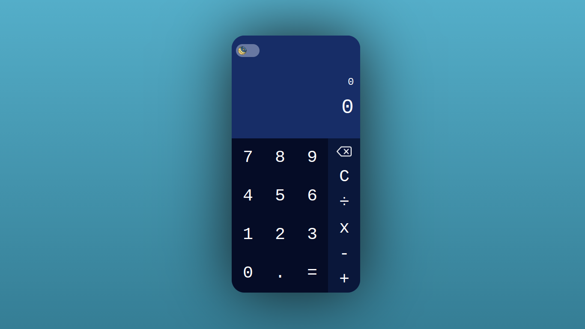
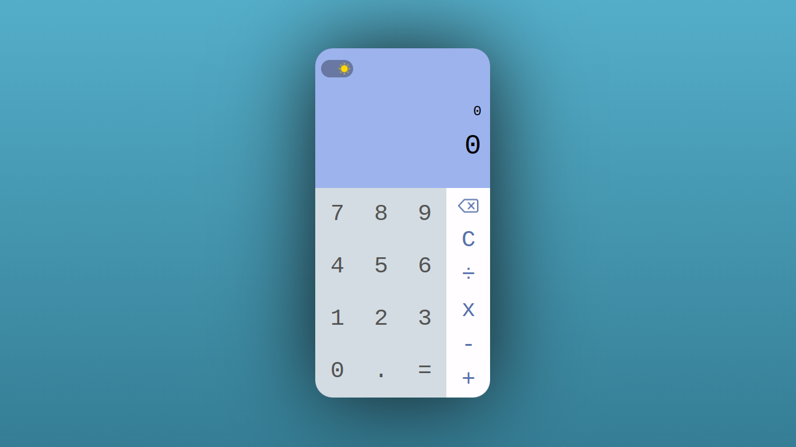

# Calculadora Criada com React 🖩

O código pode não está escrito de acordo com as melhores práticas, pois na época do desenvolvimento desse app eu ainda estava estudando React 

## Screenshots

### Getting Started
### 1. `yarn create-react-app`
Apenas isso, depois adicione o código á pasta criada ;)
*o arquivo `server.js` só é necessário para o deploy*

# Demo

➡️ <a href="https://calculadora-react-saulo.herokuapp.com/" target="_blank">