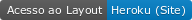
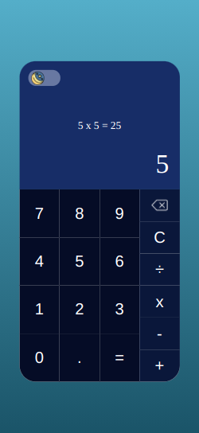
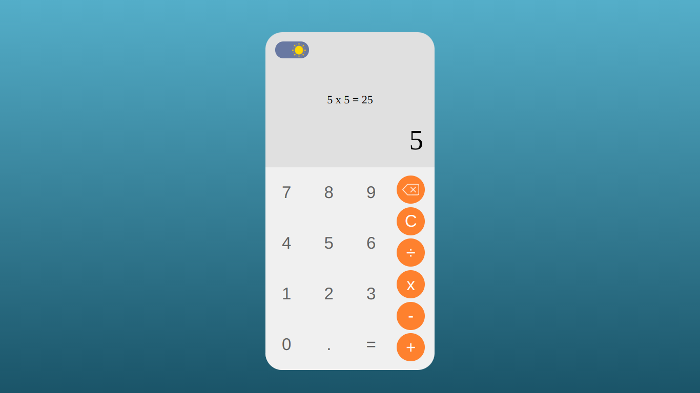
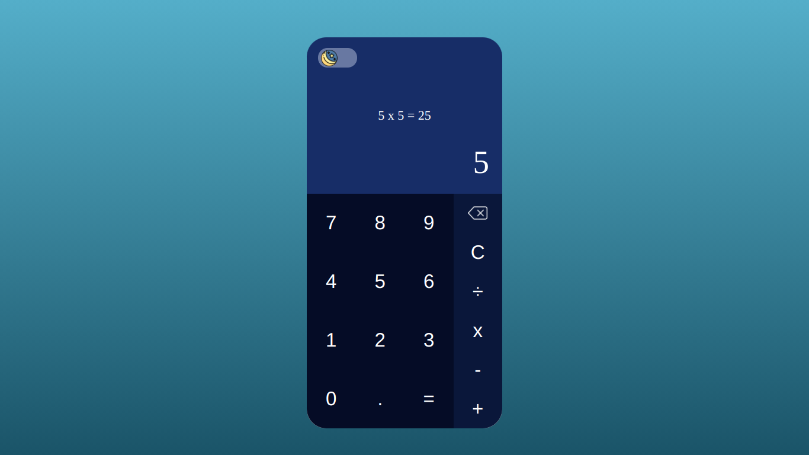

<p align="center">
    
</p>

------------------------------------
## Índice

* [Preview](#preview)
* [Sobre](#sobre)
* [Layout](#layout)
* [Como Executar](#como-executar)
* [Tecnologias](#tecnologias)
* [Autor](#autor)
* [Licença](#licenca)

------------------------------------

## 💻 Sobre <a id="sobre"></a>
 
 🖩 Calculadora completa com todas as funcionalidades desenvolvida com React ⚛️
<br>

------------------------------------

## 🚀 Preview <a id="preview"></a>

-> https://calculadora-com-react-81de.vercel.app/

------------------------------------

## ⚙️ Funcionalidades <a id="funcionalidades"></a>
1. ✅ Responsividade
2. ✅ Design e animações
3. ✅ 2 (dois) temas disponíveis
4. ✅ Soma, subtração, multiplicação e divisão
5. ✅ Preview de resultado calculado em tempo real

------------------------------------

## 🎨 Layout <a id="layout"></a>

<a href="https://calculadora-com-react-81de.vercel.app/"></a>
<p>*O Layout completo do app está disponível <a href="https://calculadora-com-react-81de.vercel.app/">aqui</a>.</p> (O carregamento da página pode demorar alguns segundos quando for entrar pela primeira vez)

<h3>Mobile (web)</h3>
<p align="center">
    
    
</p>

<h3>Desktop (web)</h3>



------------------------------------

## 🧩 Como Executar <a id="como-executar"></a>

```
# ------ 1º método usando o create react-app ------- 

$ yarn (ou npm) create react-app

# -> Depois, mover os arquivos para pasta do react-app

# ------ 2º método Instalando as dependencias -------

$ git clone https://github.com/Saulo-Felipe/Calculadora-Com-React.git

$ npm install

# Em seguida, só iniciar usando npm start 
```

------------------------------------

## 🤖 Tecnologias <a id="tecnologias"></a>

Neste simples app, foram utilizadas as seguintes tcnologias: 

* React </img>
* HTML5 </img>
* CSS3 </img>
* Javascript </img>
------------------------------------

## 👨 Autor <a id="autor"></a>

<p align="center">➡️ Desenvolvido por <strong>eu</strong> mesmo 🧑‍💻.</p>

------------------------------------

## 📜 Licença <a id="licenca"></a>

<p align="center">Todos os direitos reservados ©Copyright - Saulo Felipe</p>
